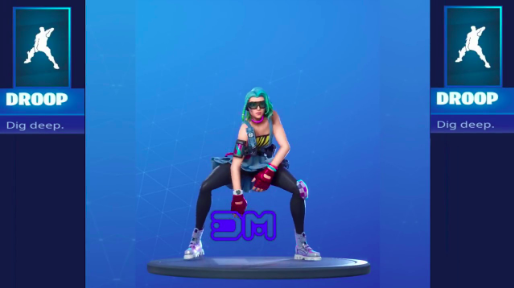
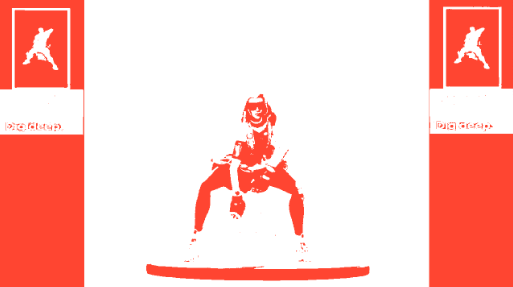
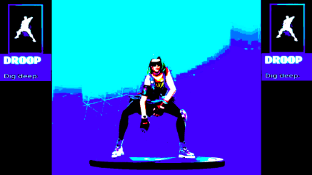
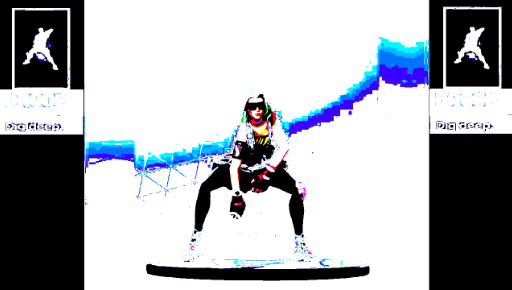
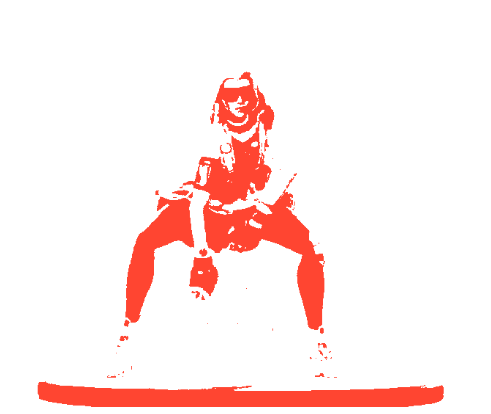

# The Dancing Screen
Presenting my Senior Design Project: *Teaching an AI to dance through Fortnite videos.*
All work is being done through Google Colab notebooks. Most recent work in [this folder](https://github.com/mkarroqe/dancing-screen/tree/master/notebooks/spring_2020).

# Input Data
My training data is extracted from this `51:52` minute [complilation video](https://www.youtube.com/watch?v=R7qdgPkPsuQ) of **146** Fornite dances. I am extracting one frame every 2 seconds for a total of **186,720** images.

# Frame Extraction Pipeline
Before my frames are fed through my model, they are converted into binary images:
| Before | After |
| :-: | :-: |
|  |  |

| | Step | Result |
| :- | :- | :-: |
| 1 | Increase contrast to reduce background gradient to blue and cyan pixels |  |
| 2 | Remove `blue` and `cyan` pixels and replace them with `white`. |  |
| 3 | Remove remaining intermediary `blue` hues and replace them with `white` pixels. With the background isolated, all other pixels are converted to `orange`.|  |
| 4 | Finally, the image is cropped to remove the sidebars. |  |
